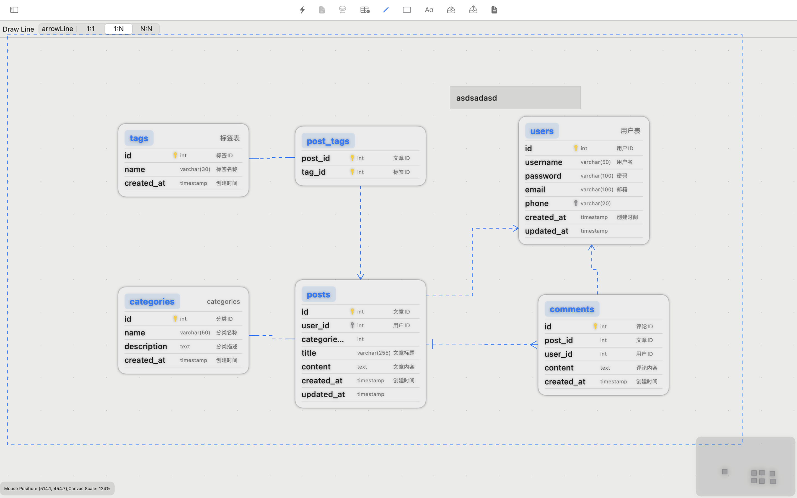

# ER Designer - Professional ERD Tool for Database Design on macOS

  
|[**DownLoad**](https://apps.apple.com/app/er-designer/id6670524297?mt=12) | [**Click for English**](#English-Version) | [**点击查看中文**](#中文介绍) | [**User Guide**](https://github.com/chainray01/er-designer-support/wiki/) | [**Open Source Components**](#开源组件--open-source-components) | [**About ERD**](https://www.databasestar.com/entity-relationship-diagram)

---

## About ER Designer
Create and manage Entity-Relationship Diagrams (ERD) with our sophisticated ER Designer platform for macOS. Perfect for MySQL database modeling and ERD design, this professional-grade tool leverages intuitive MacBook trackpad gestures to help database architects, full-stack developers, and system administrators efficiently design and maintain database schemas through visual ERD workflows.

### Advanced ERD Design Capabilities

- **Native MySQL Database Integration**  
  Connect directly to MySQL databases for seamless schema import and ERD management capabilities.

- **ERD Design State Persistence**  
  Save and load your ERD designs through file-based storage, enabling reliable backup and restoration of database modeling workspace states.

- **Professional ERD Design Interface**  
  Design normalized database tables, configure field constraints, establish primary/foreign key relationships, and optimize indexes through an intuitive ERD interface.

- **Real-time SQL Generator for ERD Designs**  
  Automatically generate SQL CREATE TABLE statements with real-time preview as you design your database ERD.

- **MacBook Trackpad ERD Navigation**  
  Leverage native MacBook trackpad gestures for precise manipulation of ERD elements, enhancing your database modeling experience.

- **Advanced Entity-Relationship Visualization**  
  Create professional entity relationship diagrams with cardinality notation and contextual annotations for enhanced database documentation.

- **Reverse Engineering ERD Designs into Databases**  
  Convert your ERD designs into deployable database structures through reverse engineering, enabling rapid deployment of conceptual schemas into production environments.

### Perfect for Database Professionals

- **Database Architects**: Create and maintain enterprise ERDs and relational schemas
- **Full-Stack Engineers**: Design database structures with visual ERD tools
- **Solutions Architects**: Communicate database designs through professional ERD visualization

ER Designer revolutionizes database modeling through sophisticated ERD visualization and design capabilities, accelerating the development of robust data architectures on macOS.

[Download ER Designer from the App Store](https://apps.apple.com/app/er-designer/id6670524297?mt=12)

---

## ER Designer 简介
ER Designer 是一款专为 macOS 设计的专业级实体关系图（ERD）设计工具，让数据库模式的设计与管理变得简单高效。支持 Mac 触控板多指操作，为数据库架构师、全栈开发工程师和系统管理员提供专业的 ERD 可视化解决方案。

### ERD 设计核心功能

- **MySQL 数据库集成**  
  与 MySQL 数据库建立安全连接，实现数据库模式导入和 ERD 管理功能。

- **ERD 设计状态持久化**  
  通过文件存储系统保存和加载 ERD 设计，实现工作区状态的可靠备份与恢复。

- **专业 ERD 设计界面**  
  通过直观的图形界面定义规范化表结构、配置字段约束、建立主外键关系并优化索引。

- **实时 SQL 生成预览**  
  在设计 ERD 时自动编译并实时预览 SQL CREATE TABLE 语句。

- **Mac 原生触控板操作**  
  利用 Mac 触控板多指手势实现 ERD 元素的精确操作，提升数据库建模体验。

- **高级实体关系图可视化**  
  创建专业的实体关系图，包含基数标注和上下文注释，增强数据库文档的可读性。

- **ERD 设计反向工程到数据库**  
  将 ERD 设计通过反向工程转换为可部署的数据库结构，实现从概念模式到生产环境的快速部署。

### 适用专业人群

- **数据库架构师**：设计和维护企业级 ERD 和关系模式
- **全栈工程师**：通过 ERD 工具加速数据库结构设计
- **解决方案架构师**：通过专业的 ERD 可视化促进团队沟通

ER Designer 通过先进的 ERD 可视化和建模功能革新了数据库设计流程，加速在 macOS 平台上构建健壮的数据架构。

[前往 App Store 下载 ER Designer](https://apps.apple.com/app/er-designer/id6670524297?mt=12)

---

This application incorporates the following open-source dependencies:  
- **mysql-kit**  
  Copyright © 2018 Qutheory, LLC  
  Distributed under the MIT License. Documentation available at: [mysql-kit GitHub Repository](https://github.com/vapor/mysql-kit?tab=MIT-1-ov-file).

---

本应用程序集成了以下开源依赖项：  
- **mysql-kit**  
  版权所有 © 2018 Qutheory, LLC  
  基于 MIT 许可证分发。文档详见：[mysql-kit GitHub 代码库](https://github.com/vapor/mysql-kit?tab=MIT-1-ov-file)。
