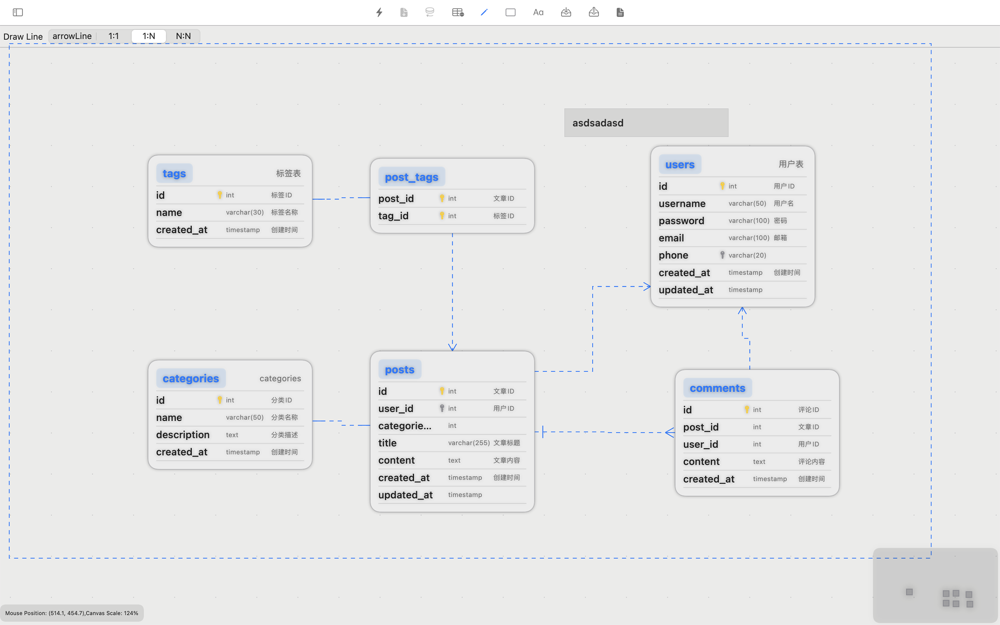

# ER Designer - 专业数据库 ERD 工具

ER Designer 是一款专业的实体关系图（ERD）设计与数据库建模平台，为 MySQL 和 PostgreSQL 数据库提供原生支持。完美结合 macOS 卓越体验与专业 ERD 设计功能，全面提升数据库架构设计效率。

[在 App Store 下载](https://apps.apple.com/app/er-designer/id6670524297?mt=12){: .btn .btn-primary }
[使用文档](./documentation-zh){: .btn }

## 专业特性

- **MySQL/PostgreSQL 支持**  
  全面支持主流数据库，智能解析表结构并实时生成 SQL 预览。

- **专业 ER 图设计**  
  清晰展示表间关联关系，帮助您掌握数据架构全局。

- **高效正向工程**  
  从可视化 ER 图一键生成精确的数据库结构和 SQL 代码。

- **智能逆向工程**  
  快速从现有数据库导入结构和关系，自动转换为直观 ER 图。

## 立即获取

ER Designer 现已在 Mac App Store 上线。

[立即下载](https://apps.apple.com/app/er-designer/id6670524297?mt=12){: .btn .btn-primary .btn-large }

[English](./index) | [中文](./zh)
